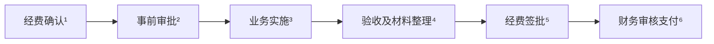
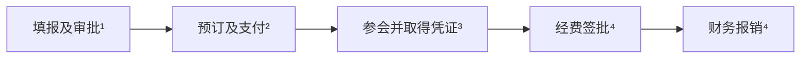
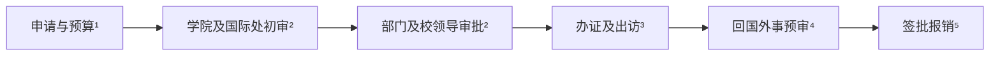
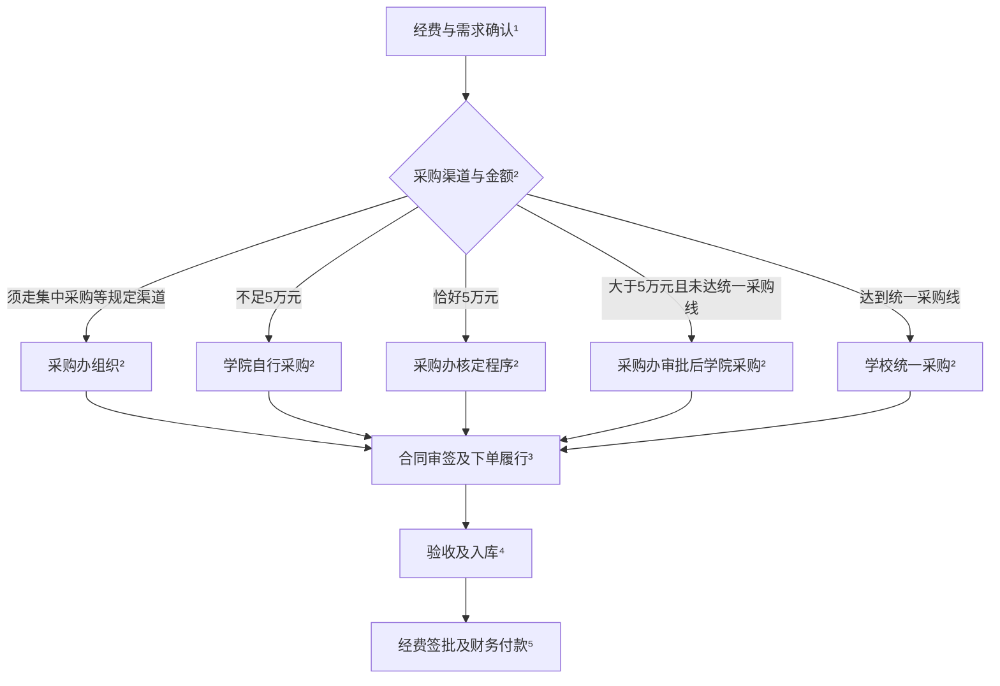
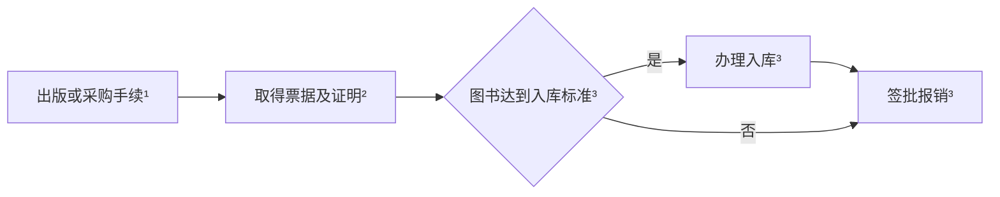
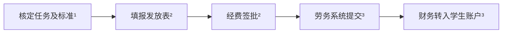
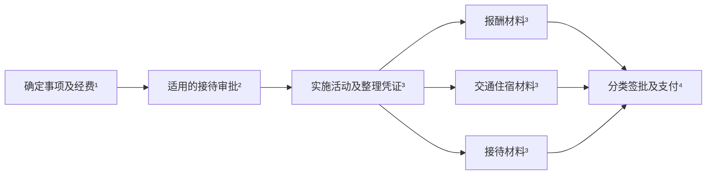

## 基本流程

| 步骤 | 办理细则 | 必备材料 | 部门/科室 | 政策依据 |
| --- | --- | --- | --- | --- |
| 1. 经费确认 | 确定项目号、支出范围、预算余额和使用期限. 启动费按下达文件, 纵向按项目批复, 横向按合同, 学院支持经费按批准用途执行 | 经费号、预算及经费下达文件 / 项目批复 / 合同 | 经费管理部门、财务处 | [审批办法第2条](https://fz.ahnu.edu.cn/__local/1/18/9B/F7AB1957910CCC3F879D7DA877A_3D987C1C_3D299.pdf) |
| 2. 事前审批 | 按业务办理出差、出访、采购、合同或接待审批, 获批后实施 | 相应业务申请单及附件, 见分类办理 | 学院、业务归口部门 | [审批办法第10、15条](https://fz.ahnu.edu.cn/__local/1/18/9B/F7AB1957910CCC3F879D7DA877A_3D987C1C_3D299.pdf) |
| 3. 业务实施 | 按批准的事项、标准和预算执行, 取得业务及付款凭证 | 票据、明细、付款凭证 | 经办人 | [审批办法第16、17条](https://fz.ahnu.edu.cn/__local/1/18/9B/F7AB1957910CCC3F879D7DA877A_3D987C1C_3D299.pdf) |
| 4. 验收及整理 | 按业务完成验收、资产入库或外事预审, 汇总材料 | 验收单、入库凭证或外事预审意见, 按业务提供 | 经办人、资产管理或外事部门 | [审批办法第15条](https://fz.ahnu.edu.cn/__local/1/18/9B/F7AB1957910CCC3F879D7DA877A_3D987C1C_3D299.pdf) |
| 5. 经费签批 | 按经费性质、单笔金额履行下表审批程序 | 报销单及对应业务材料 | 项目负责人、单位负责人及校领导 | [审批办法第5-7条](https://fz.ahnu.edu.cn/__local/1/18/9B/F7AB1957910CCC3F879D7DA877A_3D987C1C_3D299.pdf) |
| 6. 财务支付 | 审核票据、标准、预算及手续, 办理付款或冲账 | 已签批报销材料、付款或冲账材料 | 财务处 | [审批办法第14、17条](https://fz.ahnu.edu.cn/__local/1/18/9B/F7AB1957910CCC3F879D7DA877A_3D987C1C_3D299.pdf) |

> “一支笔”指单位按党政业务确定的财务审批负责人. 项目负责人本人费用由所在单位领导班子成员审批; 一支笔本人费用由单位其他负责人审批, 特殊情况由上一级负责人审批. 依据: [审批办法第4、11条](https://fz.ahnu.edu.cn/__local/1/18/9B/F7AB1957910CCC3F879D7DA877A_3D987C1C_3D299.pdf).

| 经费性质 | 单笔金额 | 审批顺序 |
| --- | --- | --- |
| 科研项目 | 不足5万元 | 项目负责人 |
| 科研项目 | 5万元至不足10万元 | 项目负责人 -> 单位一支笔 |
| 科研项目 | 10万元至不足150万元 | 项目负责人 -> 单位一支笔 -> 分管科研校领导 |
| 科研项目 | 150万元及以上 | 按前项办理并增加校长审批 |
| 学院统筹经费 | 不足20万元 | 学院一支笔 |
| 学院统筹经费 | 20万元至不足50万元 | 学院党政负责人共签 |
| 学院统筹经费 | 50万元至不足150万元 | 党政负责人共签 -> 分管校领导 |
| 学院统筹经费 | 150万元及以上 | 按前项办理并增加校长审批 |

依据: [审批办法第5-7条](https://fz.ahnu.edu.cn/__local/1/18/9B/F7AB1957910CCC3F879D7DA877A_3D987C1C_3D299.pdf). 本人费用回避与金额加批同时执行.

发票抬头: **安徽师范大学**. 纳税人识别号: **123400004851237538**. 依据: [差旅办法第25条](https://fz.ahnu.edu.cn/__local/3/20/03/ED94FD347958BF2507429B61880_D7F4BCE9_47FB6.pdf).

## 分类办理

### 国内参会、参训

参加国内学术会议、培训的交通、住宿、注册费及相关支出, 按一次出差合并办理. 返回后**3个月内**报销, 原则不跨年; 年终结账期间费用可顺延至次年2月底.

| 步骤 | 办理细则 | 必备材料 | 部门/科室 | 政策依据 |
| --- | --- | --- | --- | --- |
| 1. 出差审批 | 出发前填明人员、地点、日期、事由和经费号, 报单位负责人审批; 中层干部另按干部请假程序办理 | [出差审批单](https://fz.ahnu.edu.cn/system/_content/download.jsp?urltype=news.DownloadAttachUrl&owner=1560018605&wbfileid=2C87EE6D5FFFE35C9F76F1EA7379C2A5)、会议或培训通知 | 学院 / 单位负责人 | [差旅办法第5条](https://fz.ahnu.edu.cn/__local/3/20/03/ED94FD347958BF2507429B61880_D7F4BCE9_47FB6.pdf) |
| 2. 预订及支付 | 按职级及[住宿标准表](https://fz.ahnu.edu.cn/system/_content/download.jsp?urltype=news.DownloadAttachUrl&owner=1560018605&wbfileid=02C695BE3B2A536EAFC759D1B7C26705)预订. 一般人员高铁二等座、飞机经济舱; 乘机须路程1000公里以上或机票低于同时段高铁票价. 单笔200元及以上用**公务卡**或对公转账, 例外附项目负责人签批说明 | 交通及住宿订单、付款记录; 例外支付附签批说明 | 经办人 | [差旅办法第6、9、10、23条](https://fz.ahnu.edu.cn/__local/3/20/03/ED94FD347958BF2507429B61880_D7F4BCE9_47FB6.pdf) |
| 3. 取得凭证 | 保存参会及支付凭证. 住宿票注明入住人、起止日期和单价, 缺项补酒店证明 | 会议通知、注册费及交通住宿票据、付款记录; 缺项住宿票另附酒店证明 | 经办人 | [差旅办法第6、24条](https://fz.ahnu.edu.cn/__local/3/20/03/ED94FD347958BF2507429B61880_D7F4BCE9_47FB6.pdf) |
| 4. 报销 | 材料合并签批后报销. 伙食一般100元/人/天, 西藏、青海、新疆120元; 市内交通一般80元/人/天. 按会议通知核算食宿, 主办方包伙食时仅发在途伙食, 市内交通原则仅发在途补助 | 已批出差审批单、第2-3步凭证及报销单 | 经费审批人、财务处 | [差旅办法第14-17、20、24条](https://fz.ahnu.edu.cn/__local/3/20/03/ED94FD347958BF2507429B61880_D7F4BCE9_47FB6.pdf) |

### 出国参会

出国参会实行外事审批和经费审批. 按批准的行程及预算出访, 回国完成外事手续后报销. 出访证照、费用标准及办理时限按国际处现行要求执行.

| 步骤 | 办理细则 | 必备材料 | 部门/科室 | 政策依据 |
| --- | --- | --- | --- | --- |
| 1. 申请 | 填报因公出国系统, 明确任务、行程、预算和费用承担方 | [出国任务申请审批表, 自组团样表](https://global.ahnu.edu.cn/system/_content/download.jsp?urltype=news.DownloadAttachUrl&owner=2122923576&wbfileid=3C9623AD53C71D920E778C4C8F7B5DAB)、邀请函及翻译、详细日程、经费预算、费用承担说明 | 经办人、学院 | [出国办法第2条](https://global.ahnu.edu.cn/info/1181/3821.htm) |
| 2. 审批 | 学院审核 -> 国际处初审 -> 按人员类型由相关部门审签 -> 国际处意见 -> 校领导审批 | 第1步申请材料; 外单位组团另用[双跨团申请审批样表](https://global.ahnu.edu.cn/system/_content/download.jsp?urltype=news.DownloadAttachUrl&owner=2122923576&wbfileid=432FA3DF670B4F3155991203296BD72C), 附任务通知、批件等 | 学院、国际处、相关审签部门、校领导 | [出国办法第2、3条](https://global.ahnu.edu.cn/info/1181/3821.htm) |
| 3. 出访 | 办理护照、签证及行前手续, 按批准行程执行, 保存费用凭证 | [护照、签证及行前材料模板](https://global.ahnu.edu.cn/jsfw/ygcf/mbxz.htm)所列材料; 注册、交通、住宿及支付凭证 | 经办人、国际处 | [出国办法第5、6条](https://global.ahnu.edu.cn/info/1181/3821.htm) |
| 4. 外事收尾 | 交回证件、出访总结及成果材料, 取得外事预审意见. 官网所载办法规定证件7日内、总结等10日内交回 | 出访证件、出访总结及有关成果材料 | 国际处 | [出国办法第4、5条](https://global.ahnu.edu.cn/info/1181/3821.htm) |
| 5. 报销 | 完成外事手续后履行经费签批, 交财务报销 | 任务批件、外事预审意见、票据及支付凭证; 纵向科研另附邀请函、公示、按期归国证明等 | 经费审批人、财务处 | [出国办法第5条](https://global.ahnu.edu.cn/info/1181/3821.htm); [科研报销细则附件2一(七)](https://kyc.ahnu.edu.cn/system/_content/download.jsp?urltype=news.DownloadAttachUrl&owner=1602307159&wbfileid=6EE9F9362A44D39974B41B2474A52DFD) |
### 设备与计算服务

采购分流按项目预算, 合同审签按合同金额, 经费签批按单笔支出. 学校统一采购线: 一般设备和服务10万元, 纵横向科研资金购买科研用途仪器设备15万元; 启动费是否适用15万元线由采购办核定.

| 步骤 | 办理细则 | 必备材料 | 部门/科室 | 政策依据 |
| --- | --- | --- | --- | --- |
| 1. 经费与需求确认 | 明确配置、用途、预算、经费号及资金管理类别. 设备区分资产与材料; 云服务、API、订阅及境外服务核定支出科目、结算与验收方式 | 经费下达文件、配置及预算; 按要求附[采购用途说明](https://zcc.ahnu.edu.cn/system/_content/download.jsp?urltype=news.DownloadAttachUrl&owner=1550766870&wbfileid=C37246E7205ECAC79AE149B9744860BA) | 学院、经费管理部门、采购归口、财务处 | [审批办法第2、15条](https://fz.ahnu.edu.cn/__local/1/18/9B/F7AB1957910CCC3F879D7DA877A_3D987C1C_3D299.pdf); [采购管理办法第12、14条](https://zcc.ahnu.edu.cn/info/1166/13709.htm) |
| 2. 采购分流 | 集中采购等规定渠道优先适用. 其他项目: 不足5万元由学院自行采购; 大于5万元且未达统一采购线, 经采购办审批后由学院采购; 达到统一采购线由学校采购. 第17条对5万元用“以上/以下”表述, 恰好5万元由采购办核定程序 | 按程序提供[采购项目申请表, 2026版](https://zcc.ahnu.edu.cn/system/_content/download.jsp?urltype=news.DownloadAttachUrl&owner=1550766870&wbfileid=4E8191CC4ED9C8244BFD7B78D8DA86E2)及[简易程序编制书](https://zcc.ahnu.edu.cn/system/_content/download.jsp?urltype=news.DownloadAttachUrl&owner=1550766870&wbfileid=FCA204CF386FEB20F4718B0723B71976) / [标准程序编制书](https://zcc.ahnu.edu.cn/system/_content/download.jsp?urltype=news.DownloadAttachUrl&owner=1550766870&wbfileid=520CF0E61967060B974133F526984FB0); 询比价使用[二级单位询比价采购模板, ZIP](https://zcc.ahnu.edu.cn/system/_content/download.jsp?urltype=news.DownloadAttachUrl&owner=1550766870&wbfileid=EB99B77A4927C0AE5843407009F24631), 留存报价、评审及成交记录 | 学院、采购管理办公室、学校采购部门 | [采购管理办法第16-18、21-23条](https://zcc.ahnu.edu.cn/info/1166/13709.htm) |
| 3. 合同与履行 | 需要合同时, 承办单位审核 -> 法律事务部门审查 -> 有权人签署 -> 用印及备案. 2万元至不足10万元由承办单位负责人审签, 10万元至不足100万元由分管校领导审签, 100万元及以上由校长或书面授权人审签; 不足2万元核定授权手续. 纵向单笔2万元及以上报销附合同, 校内划拨除外. 完成适用手续后下单履行 | 适用合同正文及[经济合同审签表](https://cwc.ahnu.edu.cn/system/_content/download.jsp?urltype=news.DownloadAttachUrl&owner=1551719560&wbfileid=B0DDFA50481797927EE55BC4A32988C3); 正文采用学院或采购归口提供的适用文本 | 学院 / 承办单位、法律事务部门、有权签署人、财务处; 小额授权由财务处 / 学校办公室核定 | [合同办法第7-12、18、19条](https://cwc.ahnu.edu.cn/info/1004/1534.htm); [合同审签权限第一至六项](https://cwc.ahnu.edu.cn/info/1004/1535.htm); [科研报销细则附件2第14页](https://kyc.ahnu.edu.cn/system/_content/download.jsp?urltype=news.DownloadAttachUrl&owner=1602307159&wbfileid=6EE9F9362A44D39974B41B2474A52DFD) |
| 4. 验收与入库 | 组织验收, 不合格由供应商整改后复验. 设备、软件等资产办理登记; 材料按类别验收登记, 纵向材料单笔“5000元以上”附验收入库单; 服务按合同确认交付. 按采购程序办理结项备案 | 设备: [设备到货安装验收单](https://zcc.ahnu.edu.cn/__local/F/AA/96/9FB3A67E308FF428B487F561E13_AFDA16A5_11200.doc?e=.doc)及入库凭证, 见[固定资产建账流程](https://zcc.ahnu.edu.cn/info/1149/2857.htm); 材料: 清单及适用入库凭证; 服务: 交付清单、服务期间、结算明细及验收记录; 科研外协另附科研部审批材料 | 学院、业务管理部门、资产管理员及资产管理部门、采购办; 科研外协涉及科研部 | [采购管理办法第14、23条](https://zcc.ahnu.edu.cn/info/1166/13709.htm); [科研报销细则附件2一(一)(二)(八)(十二)](https://kyc.ahnu.edu.cn/system/_content/download.jsp?urltype=news.DownloadAttachUrl&owner=1602307159&wbfileid=6EE9F9362A44D39974B41B2474A52DFD); [科研部审批材料, 附件2一(十五)](https://kyc.ahnu.edu.cn/system/_content/download.jsp?urltype=news.DownloadAttachUrl&owner=1602307159&wbfileid=6EE9F9362A44D39974B41B2474A52DFD) |
| 5. 签批与付款 | 按基本流程“签批权限”表办理, 执行本人费用回避. 财务审核后付款或冲账, 材料不齐由经办人补正 | 报销单、发票及清单、采购审批与成交记录、适用合同、第4步验收及入库材料、付款或冲账材料 | 经办人、经费审批人、财务处 | [审批办法第5-7、11、14-17条](https://fz.ahnu.edu.cn/__local/1/18/9B/F7AB1957910CCC3F879D7DA877A_3D987C1C_3D299.pdf) |

### 论文与资料

论文版面费、著作出版、专业图书和打印费用按科研用途列支, 分别提供录用、出版、书目或印制明细.

| 步骤 | 办理细则 | 必备材料 | 部门/科室 | 政策依据 |
| --- | --- | --- | --- | --- |
| 1. 办理业务 | 论文依录用通知缴费; 著作先办理出版合同审签; 图书、打印按采购要求办理. 润色、翻译、会员费及境外支付由财务核定科目与凭证 | 论文录用通知; 著作出版合同及[经济合同审签表](https://cwc.ahnu.edu.cn/system/_content/download.jsp?urltype=news.DownloadAttachUrl&owner=1551719560&wbfileid=B0DDFA50481797927EE55BC4A32988C3); 图书、打印按采购程序提供材料 | 经办人、学院、采购 / 合同归口、财务处 | [审批办法第2、15、17条](https://fz.ahnu.edu.cn/__local/1/18/9B/F7AB1957910CCC3F879D7DA877A_3D987C1C_3D299.pdf); [科研报销细则附件2一(八)](https://kyc.ahnu.edu.cn/system/_content/download.jsp?urltype=news.DownloadAttachUrl&owner=1602307159&wbfileid=6EE9F9362A44D39974B41B2474A52DFD) |
| 2. 取得材料 | 按论文、著作、图书、打印分别整理业务证明和票据 | 论文: 发票及用稿通知, 或期刊封面与目录; 著作: 发票及出版合同; 图书: 发票及销售单位盖章书目清单; 打印: 发票 / 划拨单及内容、数量、单价清单 | 经办人 | [科研报销细则附件2一(八)(九)(十三)](https://kyc.ahnu.edu.cn/system/_content/download.jsp?urltype=news.DownloadAttachUrl&owner=1602307159&wbfileid=6EE9F9362A44D39974B41B2474A52DFD) |
| 3. 入库及报销 | 单套图书1500元及以上附入库单. 材料齐备后签批报销; 著作预借款于出版后冲账; 差旅中打印随该次差旅办理 | 第1-2步材料、报销单; 达标图书另附入库单, 预借款另附冲账材料 | 图书入库办理部门、经费审批人、财务处 | [科研报销细则附件2一(八)(九)](https://kyc.ahnu.edu.cn/system/_content/download.jsp?urltype=news.DownloadAttachUrl&owner=1602307159&wbfileid=6EE9F9362A44D39974B41B2474A52DFD); [差旅办法第20条](https://fz.ahnu.edu.cn/__local/3/20/03/ED94FD347958BF2507429B61880_D7F4BCE9_47FB6.pdf) |

### 学生科研劳务

学生参与项目研究的劳务费用, 按经费适用范围和项目主管标准核定, 通过劳务系统发至本人账户.

| 步骤 | 办理细则 | 必备材料 | 部门/科室 | 政策依据 |
| --- | --- | --- | --- | --- |
| 1. 核定劳务 | 确定参与人员、研究任务、期间和发放标准, 在经费允许范围内安排 | 研究任务、参与人员、劳务期间和标准说明 | 项目负责人、经费管理部门 | [纵向办法第5条](https://kyc.ahnu.edu.cn/system/_content/download.jsp?urltype=news.DownloadAttachUrl&owner=1602307159&wbfileid=6EE9F9362A44D39974B41B2474A52DFD) |
| 2. 填报签批 | 在[劳务申报系统](https://cwc.ahnu.edu.cn/info/1007/1604.htm)填报发放信息, 按系统流程办理发放表及经费签批 | 劳务发放表; 姓名、身份证号 / 学号、银行卡号、金额及经办人联系电话 | 经办人、经费审批人 | [科研报销细则附件2一(十)](https://kyc.ahnu.edu.cn/system/_content/download.jsp?urltype=news.DownloadAttachUrl&owner=1602307159&wbfileid=6EE9F9362A44D39974B41B2474A52DFD); [审批办法第7条](https://fz.ahnu.edu.cn/__local/1/18/9B/F7AB1957910CCC3F879D7DA877A_3D987C1C_3D299.pdf) |
| 3. 系统发放 | 经劳务系统提交, 财务审核后转入学生本人账户 | 完成签批的劳务发放表及系统要求的附件 | 经办人、财务处 | [科研报销细则附件2一(十)1](https://kyc.ahnu.edu.cn/system/_content/download.jsp?urltype=news.DownloadAttachUrl&owner=1602307159&wbfileid=6EE9F9362A44D39974B41B2474A52DFD) |

### 邀请专家

专家邀请费用分为咨询或讲座报酬、交通住宿、公务接待三类, 分别核定标准和材料.

| 步骤 | 办理细则 | 必备材料 | 部门/科室 | 政策依据 |
| --- | --- | --- | --- | --- |
| 1. 确定事项 | 核定咨询或讲座性质、经费和报酬标准, 明确交通住宿承担方; 涉外事项交国际处. 讲课费按适用讲座规定核定 | 邀请事项、经费及报酬标准、交通住宿承担安排 | 学院、经费管理部门; 涉外涉及国际处 | [审批办法第2、10、17条](https://fz.ahnu.edu.cn/__local/1/18/9B/F7AB1957910CCC3F879D7DA877A_3D987C1C_3D299.pdf); [科研报销细则附件2一(十一)](https://kyc.ahnu.edu.cn/system/_content/download.jsp?urltype=news.DownloadAttachUrl&owner=1602307159&wbfileid=6EE9F9362A44D39974B41B2474A52DFD) |
| 2. 接待审批 | 符合接待条件的, 报单位主要负责人审批. 花津校区校外接待须事前经资产经营公司认可 | 公函或[邀请函](https://fz.ahnu.edu.cn/system/_content/download.jsp?urltype=news.DownloadAttachUrl&owner=1560018605&wbfileid=479BB748E2A7999290341BE77CC842DD)、[接待审批单](https://fz.ahnu.edu.cn/system/_content/download.jsp?urltype=news.DownloadAttachUrl&owner=1560018605&wbfileid=53075B936F2E95E56FDD49A752429045) | 单位主要负责人; 校外接待涉及资产经营公司 | [接待办法第4-6条](https://fz.ahnu.edu.cn/__local/F/95/51/9202209FC60787A8C5AF176A471_FA7D845D_31AB2.pdf); [节约细则第11项](https://fz.ahnu.edu.cn/__local/0/CB/E4/4CF313A5A0E96C0B1D66E7CE894_B42D3582_30969.pdf) |
| 3. 整理凭证 | 实施活动后按报酬、交通住宿、接待分别整理材料; 咨询报酬在[劳务申报系统](https://cwc.ahnu.edu.cn/info/1007/1604.htm)填报 | 报酬: 发放表及专家姓名、职称、身份证号、银行卡号、形式、时间、经办人电话; 交通住宿: 获批安排及票据; 接待: 公函、审批单、发票及经办人签字消费明细 | 经办人 | [科研报销细则附件2一(十一)](https://kyc.ahnu.edu.cn/system/_content/download.jsp?urltype=news.DownloadAttachUrl&owner=1602307159&wbfileid=6EE9F9362A44D39974B41B2474A52DFD); [接待办法第19条](https://fz.ahnu.edu.cn/__local/F/95/51/9202209FC60787A8C5AF176A471_FA7D845D_31AB2.pdf) |
| 4. 分类支付 | 分别履行经费签批. 报酬打卡, 交通住宿按批准承担范围报销, 接待用公务卡或转账结算 | 分类报销或发放表、第2-3步适用材料及付款信息 | 经费审批人、财务处 | [科研报销细则附件2一(十一)](https://kyc.ahnu.edu.cn/system/_content/download.jsp?urltype=news.DownloadAttachUrl&owner=1602307159&wbfileid=6EE9F9362A44D39974B41B2474A52DFD); [接待办法第13、18、20条](https://fz.ahnu.edu.cn/__local/F/95/51/9202209FC60787A8C5AF176A471_FA7D845D_31AB2.pdf) |

纵向咨询费标准为高级职称1500-2400元、其他900-1500元/人天(税后), 院士或全国知名专家可上浮50%, 同时执行项目主管要求. 公务接待餐限一次, 不超200元/人/天, 不提供酒水; 来宾不超10人时陪餐不超3人, 超10人时不超来宾人数1/3. 依据: [科研报销细则附件2一(十一)](https://kyc.ahnu.edu.cn/system/_content/download.jsp?urltype=news.DownloadAttachUrl&owner=1602307159&wbfileid=6EE9F9362A44D39974B41B2474A52DFD), [接待办法第11、12条](https://fz.ahnu.edu.cn/__local/F/95/51/9202209FC60787A8C5AF176A471_FA7D845D_31AB2.pdf).

## 附录. 政策文件

| 文件 | 主要内容 |
| --- | --- |
| [经费支出审批管理办法, 校财字〔2026〕5号](https://fz.ahnu.edu.cn/__local/1/18/9B/F7AB1957910CCC3F879D7DA877A_3D987C1C_3D299.pdf) | 经费支出条件、金额权限、本人费用审批及财务审核 |
| [差旅费管理办法, 校财字〔2026〕3号](https://fz.ahnu.edu.cn/__local/3/20/03/ED94FD347958BF2507429B61880_D7F4BCE9_47FB6.pdf) | 国内交通住宿、补助、支付方式和报销期限; 配套[出差审批单](https://fz.ahnu.edu.cn/system/_content/download.jsp?urltype=news.DownloadAttachUrl&owner=1560018605&wbfileid=2C87EE6D5FFFE35C9F76F1EA7379C2A5)、[住宿伙食标准表](https://fz.ahnu.edu.cn/system/_content/download.jsp?urltype=news.DownloadAttachUrl&owner=1560018605&wbfileid=02C695BE3B2A536EAFC759D1B7C26705) |
| [教职工因公出国境管理办法, 官网2018年发布](https://global.ahnu.edu.cn/info/1181/3821.htm) | 出访申请、部门审签、行前管理、回国手续和外事预审 |
| [纵向科研项目资金管理办法, 校科字〔2022〕10号](https://kyc.ahnu.edu.cn/system/_content/download.jsp?urltype=news.DownloadAttachUrl&owner=1602307159&wbfileid=6EE9F9362A44D39974B41B2474A52DFD) | 预算、费用、绩效和结余管理; 附件2第14-22页为报销细则. 适用于纵向经费及明确参照执行的经费 |
| [采购管理办法](https://zcc.ahnu.edu.cn/info/1166/13709.htm) | 采购归口、校内限额、合同、验收及结项 |
| [安徽省政府集中采购目录及标准, 2026年版](https://cz.huainan.gov.cn/group4/M00/10/99/rB40qWjD_BmAVbmSAAZ_Y0Q-_BY681.pdf) | 集中采购品目、框架协议及政府采购限额 |
| [合同管理办法, 校财字〔2020〕13号](https://cwc.ahnu.edu.cn/system/_content/download.jsp?urltype=news.DownloadAttachUrl&owner=1551719560&wbfileid=1163C841D360FF3FFA84F088EDB398AB) | 合同拟定、法律审查、授权签署、用印和备案 |
| [合同审签权限范围, 校财字〔2020〕14号](https://cwc.ahnu.edu.cn/system/_content/download.jsp?urltype=news.DownloadAttachUrl&owner=1551719560&wbfileid=799FC7D982DB3406C610CE6D4310D8A7) | 按合同金额确定审签人 |
| [国内公务接待管理办法, 校财字〔2026〕7号](https://fz.ahnu.edu.cn/__local/F/95/51/9202209FC60787A8C5AF176A471_FA7D845D_31AB2.pdf) | 接待条件、标准和结算材料; 配套[接待审批单](https://fz.ahnu.edu.cn/system/_content/download.jsp?urltype=news.DownloadAttachUrl&owner=1560018605&wbfileid=53075B936F2E95E56FDD49A752429045)、[邀请函](https://fz.ahnu.edu.cn/system/_content/download.jsp?urltype=news.DownloadAttachUrl&owner=1560018605&wbfileid=479BB748E2A7999290341BE77CC842DD) |
| [开源节流、厉行节约实施细则, 校财字〔2026〕4号](https://fz.ahnu.edu.cn/__local/0/CB/E4/4CF313A5A0E96C0B1D66E7CE894_B42D3582_30969.pdf) | 校外接待、办公用品采购及其他节约要求 |
| [2026年涉财制度解读资料](https://cwc.ahnu.edu.cn/info/1007/2357.htm) | 差旅及合同等解读PPTX; 合同解读第15页注明新办法2027-01-01起执行 |
| [网上报销系统操作说明, 2019年发布](https://cwc.ahnu.edu.cn/info/1011/1344.htm) | 网上填单操作资料, 系统办理以财务处现行安排为准 |

### 表单与办理入口

| 材料 | 文件与入口 | 用途 |
| --- | --- | --- |
| 采购申请与需求 | [采购申请表](https://zcc.ahnu.edu.cn/system/_content/download.jsp?urltype=news.DownloadAttachUrl&owner=1550766870&wbfileid=4E8191CC4ED9C8244BFD7B78D8DA86E2)、[用途说明](https://zcc.ahnu.edu.cn/system/_content/download.jsp?urltype=news.DownloadAttachUrl&owner=1550766870&wbfileid=C37246E7205ECAC79AE149B9744860BA)、[简易计划](https://zcc.ahnu.edu.cn/system/_content/download.jsp?urltype=news.DownloadAttachUrl&owner=1550766870&wbfileid=FCA204CF386FEB20F4718B0723B71976)、[标准计划](https://zcc.ahnu.edu.cn/system/_content/download.jsp?urltype=news.DownloadAttachUrl&owner=1550766870&wbfileid=520CF0E61967060B974133F526984FB0) | 采购事前申请, 按批准程序选用 |
| 学院询比价 | [二级单位询比价模板, 2026版, ZIP](https://zcc.ahnu.edu.cn/system/_content/download.jsp?urltype=news.DownloadAttachUrl&owner=1550766870&wbfileid=EB99B77A4927C0AE5843407009F24631) | 学院采用询比价采购时使用 |
| 合同审批 | [经济合同审签表, DOC](https://cwc.ahnu.edu.cn/system/_content/download.jsp?urltype=news.DownloadAttachUrl&owner=1551719560&wbfileid=B0DDFA50481797927EE55BC4A32988C3) | 附适用合同正文办理审签 |
| 设备验收与入库 | [设备验收单, DOC](https://zcc.ahnu.edu.cn/__local/F/AA/96/9FB3A67E308FF428B487F561E13_AFDA16A5_11200.doc?e=.doc)、[建账流程](https://zcc.ahnu.edu.cn/info/1149/2857.htm) | 验收单填写后组织验收, 入库凭证由资产管理环节出具 |
| 出国申请 | [自组团样表](https://global.ahnu.edu.cn/system/_content/download.jsp?urltype=news.DownloadAttachUrl&owner=2122923576&wbfileid=3C9623AD53C71D920E778C4C8F7B5DAB)、[双跨团样表](https://global.ahnu.edu.cn/system/_content/download.jsp?urltype=news.DownloadAttachUrl&owner=2122923576&wbfileid=432FA3DF670B4F3155991203296BD72C)、[证件与行前模板](https://global.ahnu.edu.cn/jsfw/ygcf/mbxz.htm) | 按团组类型及外事要求选用 |
| 劳务发放 | [劳务申报系统及安装包](https://cwc.ahnu.edu.cn/info/1007/1604.htm) | 学生、专家发放信息按系统流程办理; 此链接为系统入口, 非空白发放表 |

附件入口可能要求验证码. 采购及询比价模板见[资产处下载中心](https://zcc.ahnu.edu.cn/xzzx/ztbcgzlxz.htm); 合同正文按具体采购或出版事项采用适用文本.

