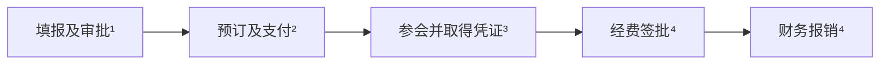
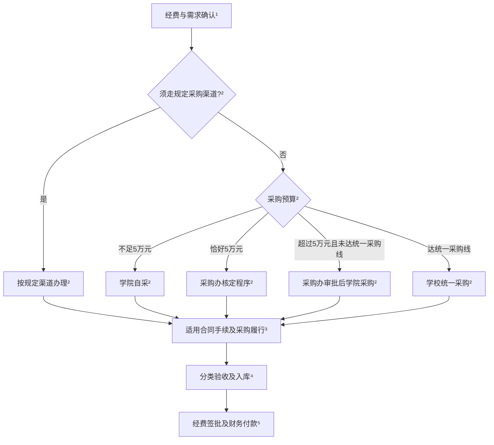
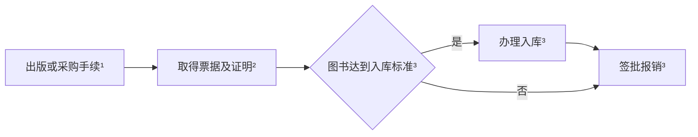
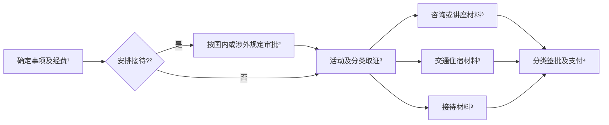

## 基本流程

| 步骤 | 办理细则 | 必备材料 | 部门/科室 | 政策依据 |
| --- | --- | --- | --- | --- |
| 1. 经费确认 | 确定项目号、支出范围、预算余额和使用期限. 启动费按下达文件, 纵向按项目批复, 横向按合同, 学院支持经费按批准用途执行 | 经费号、预算及经费下达文件 / 项目批复 / 合同 | 经费管理部门、财务处 | [审批办法第2条](https://fz.ahnu.edu.cn/__local/1/18/9B/F7AB1957910CCC3F879D7DA877A_3D987C1C_3D299.pdf) |
| 2. 事前审批 | 按业务办理出差、出访、采购、合同或接待审批, 获批后实施 | 相应业务申请单及附件, 见分类办理 | 学院、业务归口部门 | [审批办法第10、15条](https://fz.ahnu.edu.cn/__local/1/18/9B/F7AB1957910CCC3F879D7DA877A_3D987C1C_3D299.pdf) |
| 3. 业务实施 | 按批准的事项、标准和预算执行, 取得业务及付款凭证 | 票据、明细、付款凭证 | 经办人 | [审批办法第16、17条](https://fz.ahnu.edu.cn/__local/1/18/9B/F7AB1957910CCC3F879D7DA877A_3D987C1C_3D299.pdf) |
| 4. 验收及整理 | 按业务完成验收、资产入库或外事预审, 汇总材料 | 验收单、入库凭证或外事预审意见, 按业务提供 | 经办人、资产管理或外事部门 | [审批办法第15条](https://fz.ahnu.edu.cn/__local/1/18/9B/F7AB1957910CCC3F879D7DA877A_3D987C1C_3D299.pdf) |
| 5. 经费签批 | 按经费性质、单笔金额履行下表审批程序 | 报销单及对应业务材料 | 项目负责人、单位负责人及校领导 | [审批办法第5-7条](https://fz.ahnu.edu.cn/__local/1/18/9B/F7AB1957910CCC3F879D7DA877A_3D987C1C_3D299.pdf) |
| 6. 财务支付 | 审核票据、标准、预算及手续, 办理付款或冲账 | 已签批报销材料、付款或冲账材料 | 财务处 | [审批办法第14、17条](https://fz.ahnu.edu.cn/__local/1/18/9B/F7AB1957910CCC3F879D7DA877A_3D987C1C_3D299.pdf) |

> “一支笔”指单位按党政业务确定的财务审批负责人. 项目负责人本人费用由所在单位领导班子成员审批; 一支笔本人费用由单位其他负责人审批, 特殊情况由上一级负责人审批. 依据: [审批办法第4、11条](https://fz.ahnu.edu.cn/__local/1/18/9B/F7AB1957910CCC3F879D7DA877A_3D987C1C_3D299.pdf).

| 经费性质 | 单笔金额 | 审批顺序 |
| --- | --- | --- |
| 科研项目 | 不足5万元 | 项目负责人 |
| 科研项目 | 5万元至不足10万元 | 项目负责人 -> 单位一支笔 |
| 科研项目 | 10万元至不足150万元 | 项目负责人 -> 单位一支笔 -> 分管科研校领导 |
| 科研项目 | 150万元及以上 | 按前项办理并增加校长审批 |
| 学院统筹经费 | 不足20万元 | 学院一支笔 |
| 学院统筹经费 | 20万元至不足50万元 | 学院党政负责人共签 |
| 学院统筹经费 | 50万元至不足150万元 | 党政负责人共签 -> 分管校领导 |
| 学院统筹经费 | 150万元及以上 | 按前项办理并增加校长审批 |

依据: [审批办法第5-7条](https://fz.ahnu.edu.cn/__local/1/18/9B/F7AB1957910CCC3F879D7DA877A_3D987C1C_3D299.pdf). 本人费用回避与金额加批同时执行.

发票抬头: **安徽师范大学**. 纳税人识别号: **123400004851237538**. 依据: [差旅办法第25条](https://fz.ahnu.edu.cn/__local/3/20/03/ED94FD347958BF2507429B61880_D7F4BCE9_47FB6.pdf).

## 分类办理

图中上标对应步骤编号; 同号各行按条件适用, 同时符合多项的合并材料. 引用“纵向细则”的材料要求适用于纵向及明确参照执行的经费; 启动费、横向及学院经费先确认适用制度.

### 国内参会、参训

参加国内学术会议、培训的交通、住宿、注册费及相关支出, 按一次出差合并办理. 返回后**3个月内**报销, 原则不跨年; 年终结账期间费用可顺延至次年2月底.

| 步骤 | 办理细则 | 必备材料 | 部门/科室 | 政策依据 |
| --- | --- | --- | --- | --- |
| 1. 正常出差 | 出发前填写人员、地点、日期、事由和经费号, 办理事前审批 | [出差审批单](https://fz.ahnu.edu.cn/system/_content/download.jsp?urltype=news.DownloadAttachUrl&owner=1560018605&wbfileid=2C87EE6D5FFFE35C9F76F1EA7379C2A5); 中层干部改用领导干部离校请假报告单 | 学院 / 单位负责人 | [差旅办法第5条](https://fz.ahnu.edu.cn/__local/3/20/03/ED94FD347958BF2507429B61880_D7F4BCE9_47FB6.pdf) |
| 1. 突发公务未事前审批 | 事后7日内补办, 经单位主要负责人审签 | 相应审批单、突发公务情况说明 | 单位主要负责人 | [差旅办法第5条](https://fz.ahnu.edu.cn/__local/3/20/03/ED94FD347958BF2507429B61880_D7F4BCE9_47FB6.pdf) |
| 2. 常规预订与支付 | 按职级和[住宿标准表](https://fz.ahnu.edu.cn/system/_content/download.jsp?urltype=news.DownloadAttachUrl&owner=1560018605&wbfileid=02C695BE3B2A536EAFC759D1B7C26705)预订. 一般人员高铁二等座、飞机经济舱; 乘机须路程1000公里以上或机票低于同时段高铁票价. 单笔200元及以上用公务卡或对公转账 | 实际发生费用的订单及公务卡消费 / 转账记录 | 经办人 | [差旅办法第6、9、10、23条](https://fz.ahnu.edu.cn/__local/3/20/03/ED94FD347958BF2507429B61880_D7F4BCE9_47FB6.pdf) |
| 2. 无公务卡支付条件等例外 | 符合无刷卡条件或小额零星支出情形的, 说明原因并签批 | 付款凭证、项目负责人签批的原因说明 | 经办人、项目负责人 | [差旅办法第23条](https://fz.ahnu.edu.cn/__local/3/20/03/ED94FD347958BF2507429B61880_D7F4BCE9_47FB6.pdf) |
| 3. 交通、注册费 | 按实际发生的参会参训费用取票 | 会议 / 培训通知、车船票或机票行程单及舱位证明、注册费票据、付款记录 | 经办人 | [差旅办法第11、24条](https://fz.ahnu.edu.cn/__local/3/20/03/ED94FD347958BF2507429B61880_D7F4BCE9_47FB6.pdf) |
| 3. 自行安排住宿 | 限额内据实报销, 住宿票缺项时补酒店证明 | 住宿发票, 注明入住人、起止日期、单价; 缺项另附酒店支撑材料 | 经办人 | [差旅办法第6条](https://fz.ahnu.edu.cn/__local/3/20/03/ED94FD347958BF2507429B61880_D7F4BCE9_47FB6.pdf) |
| 3. 主办方指定住宿且超标 | 主办方统一安排、费用自理的, 凭指定酒店及标准证明据实报销 | 住宿发票、注明指定酒店名称及住宿标准的通知等证明 | 经办人、财务处 | [差旅办法第8条](https://fz.ahnu.edu.cn/__local/3/20/03/ED94FD347958BF2507429B61880_D7F4BCE9_47FB6.pdf) |
| 3. 对方免费提供住宿 | 不报住宿费, 按规定核算交通费和补助 | 对方单位签章的住宿证明、交通凭证 | 经办人、财务处 | [差旅办法第21条第(一)项](https://fz.ahnu.edu.cn/__local/3/20/03/ED94FD347958BF2507429B61880_D7F4BCE9_47FB6.pdf) |
| 3. 其他原因缺住宿发票 | 原则上报销城市间交通费, 仅领取在途伙食及市内交通补助 | 城市间交通费票据、相应出差材料 | 经办人、财务处 | [差旅办法第21条第(三)项](https://fz.ahnu.edu.cn/__local/3/20/03/ED94FD347958BF2507429B61880_D7F4BCE9_47FB6.pdf) |
| 3. 纵向科研差旅包干 | 2022细则列有包干方式; 采用前由财务确认该项目现行适用口径, 不与凭据报销重复 | 适用包干方式时: 出差审批表、城市间交通票据; 住宿及市内交通票据按包干规定免附 | 经办人、财务处 | [纵向细则附件2一(五)3](https://kyc.ahnu.edu.cn/system/_content/download.jsp?urltype=news.DownloadAttachUrl&owner=1602307159&wbfileid=6EE9F9362A44D39974B41B2474A52DFD); [差旅办法第2、21条](https://fz.ahnu.edu.cn/__local/3/20/03/ED94FD347958BF2507429B61880_D7F4BCE9_47FB6.pdf) |
| 3. 改签或退票 | 特殊原因产生的费用随差旅报销 | 改退签费用票据、单位负责人审签的情况说明 | 经办人、单位负责人 | [差旅办法第11条](https://fz.ahnu.edu.cn/__local/3/20/03/ED94FD347958BF2507429B61880_D7F4BCE9_47FB6.pdf) |
| 3. 特殊原因提高乘坐等级 | 经单位负责人审签; 仍受禁止报销等级限制 | 相应交通票据、单位负责人审签的书面说明 | 经办人、单位负责人 | [差旅办法第12条](https://fz.ahnu.edu.cn/__local/3/20/03/ED94FD347958BF2507429B61880_D7F4BCE9_47FB6.pdf) |
| 3. 不可控因素超期住宿 | 有证明的按规定据实报销; 个人原因超期自理 | 住宿票据、不可控因素证明 | 经办人、财务处 | [差旅办法第7条](https://fz.ahnu.edu.cn/__local/3/20/03/ED94FD347958BF2507429B61880_D7F4BCE9_47FB6.pdf) |
| 4. 签批报销 | 同次出差合并办理. 伙食一般100元/人/天, 西藏、青海、新疆120元; 市内交通一般80元/人/天. 主办方包伙食时仅发在途伙食, 参会参训市内交通原则仅发在途补助 | 已批出差单、会议 / 培训通知、上述实际发生费用对应凭证、报销单 | 经费审批人、财务处 | [差旅办法第14-17、20、24条](https://fz.ahnu.edu.cn/__local/3/20/03/ED94FD347958BF2507429B61880_D7F4BCE9_47FB6.pdf) |
| 4. 会期内另有公务市内交通 | 注明行程、事由, 单位负责人审签后在限额内据实报销 | 市内交通发票、行程及事由说明、审签意见 | 单位负责人、财务处 | [差旅办法第16条](https://fz.ahnu.edu.cn/__local/3/20/03/ED94FD347958BF2507429B61880_D7F4BCE9_47FB6.pdf) |

### 出国参会

出国参会实行外事审批和经费审批. 按批准的行程及预算出访, 回国完成外事手续后报销. 出访证照、费用标准及办理时限按国际处现行要求执行.

| 步骤 | 办理细则 | 必备材料 | 部门/科室 | 政策依据 |
| --- | --- | --- | --- | --- |
| 1. 自组团申请 | 填报因公出国系统, 落实任务、日程和经费 | [出国任务申请审批表, 自组团样表](https://global.ahnu.edu.cn/system/_content/download.jsp?urltype=news.DownloadAttachUrl&owner=2122923576&wbfileid=3C9623AD53C71D920E778C4C8F7B5DAB)、正式邀请函及翻译、详细日程、预算及费用承担说明 | 经办人、学院 | [出国办法第2条](https://global.ahnu.edu.cn/info/1181/3821.htm) |
| 1. 外单位组团申请 | 按双跨团要求申报, 补充组团单位材料 | [双跨团申请审批样表](https://global.ahnu.edu.cn/system/_content/download.jsp?urltype=news.DownloadAttachUrl&owner=2122923576&wbfileid=432FA3DF670B4F3155991203296BD72C)、邀请函及翻译、组团单位征求意见函、日程、费用预算、任务通知书及批件 | 经办人、学院、组团单位 | [出国办法第2条第(三)(四)项](https://global.ahnu.edu.cn/info/1181/3821.htm) |
| 2. 部门及校领导审批 | 学院审核 -> 国际处初审 -> 按人员类型由相关部门审签 -> 国际处意见 -> 校领导审批 | 对应团组的第1步申请材料 | 学院、国际处、人事 / 财务 / 科研等适用审签部门、校领导 | [出国办法第3条](https://global.ahnu.edu.cn/info/1181/3821.htm) |
| 2. 两人及以上出访团组 | 官网所载办法另要求出访论证, 经校党委常委会研究决定 | 第1步材料, 加出访论证报告(时间、单位、人员、任务及意义) | 学院、国际处、校党委常委会 | [出国办法第3条](https://global.ahnu.edu.cn/info/1181/3821.htm) |
| 3. 办证及出访 | 按证照状态办理护照、签证及行前手续, 执行批准行程 | [护照、签证及行前材料模板](https://global.ahnu.edu.cn/jsfw/ygcf/mbxz.htm)中适用表单、行前承诺书; 保存注册、交通、住宿及支付凭证 | 经办人、国际处 | [出国办法第5、6条](https://global.ahnu.edu.cn/info/1181/3821.htm) |
| 4. 外事收尾 | 官网所载办法规定证件7日内、总结等10日内交回 | 出访证件、出访总结; 经学校授权签订协议或项目书的, 另交相应文件 | 国际处 | [出国办法第4条](https://global.ahnu.edu.cn/info/1181/3821.htm) |
| 5. 一般报销 | 完成外事预审及经费签批; 按获批承担范围报销, 外方资助部分按规定扣除 | 任务批件、外事预审意见、实际由本校承担费用的票据及支付凭证 | 国际处、经费审批人、财务处 | [出国办法第5条](https://global.ahnu.edu.cn/info/1181/3821.htm) |
| 5. 纵向科研经费补充材料 | 在一般报销材料上补充纵向科研所需证明 | 邀请函、出国公示材料、按期归国证明; 任务批件按外事要求提供 | 经办人、国际处、财务处 | [纵向细则附件2一(七)](https://kyc.ahnu.edu.cn/system/_content/download.jsp?urltype=news.DownloadAttachUrl&owner=1602307159&wbfileid=6EE9F9362A44D39974B41B2474A52DFD); [出国办法第5条](https://global.ahnu.edu.cn/info/1181/3821.htm) |

### 设备与计算服务

采购分流按项目预算, 合同审签按合同金额, 经费签批按单笔支出. 学校统一采购线: 一般设备和服务10万元, 纵横向科研资金购买科研用途仪器设备15万元; 启动费是否适用15万元线由采购办核定.

| 步骤 | 办理细则 | 必备材料 | 部门/科室 | 政策依据 |
| --- | --- | --- | --- | --- |
| 1. 设备、材料、软件 | 确认科研用途、经费性质、预算及资产类别 | 经费号、配置清单及预算; 经费适用范围以批复 / 下达文件为据 | 学院、经费管理部门、资产及采购归口 | [审批办法第2、15条](https://fz.ahnu.edu.cn/__local/1/18/9B/F7AB1957910CCC3F879D7DA877A_3D987C1C_3D299.pdf); [采购办法第12、14条](https://zcc.ahnu.edu.cn/info/1166/13709.htm) |
| 1. 云服务、API、订阅、境外服务 | 先核定支出科目、付款方式及交付验收口径 | 服务内容、计费方案及预算; 具体凭证清单由归口部门和财务确定, 尚无统一公开表单 | 学院、采购归口、经费管理部门、财务处 | [审批办法第2、14、15条](https://fz.ahnu.edu.cn/__local/1/18/9B/F7AB1957910CCC3F879D7DA877A_3D987C1C_3D299.pdf); [采购办法第12、14条](https://zcc.ahnu.edu.cn/info/1166/13709.htm) |
| 2. 集中采购等规定渠道 | 先按品目、经费性质核定规定渠道, 不直接套用下列金额分流 | 对应渠道的采购申报资料; 项目用途按要求附[采购用途说明](https://zcc.ahnu.edu.cn/system/_content/download.jsp?urltype=news.DownloadAttachUrl&owner=1550766870&wbfileid=C37246E7205ECAC79AE149B9744860BA) | 学院、采购办 | [采购办法第16、18条](https://zcc.ahnu.edu.cn/info/1166/13709.htm) |
| 2. 不足5万元, 学院自采 | 不属于规定渠道的, 按学院内控制度组织采购 | 需求、预算及学院规定的审批材料; 学校表单按学院实际程序选用 | 学院 | [采购办法第14、17条](https://zcc.ahnu.edu.cn/info/1166/13709.htm) |
| 2. 恰好5万元 | 第17条“以上 / 以下”边界重叠, 由采购办确定程序 | 采购需求及预算, 按核定程序提供相应申请材料 | 学院、采购办 | [采购办法第17、39条](https://zcc.ahnu.edu.cn/info/1166/13709.htm) |
| 2. 超过5万元, 未达统一采购线 | 学院报采购办审批后组织采购 | 采购申请及需求、预算等配套材料, 使用[采购项目申请表, 2026版](https://zcc.ahnu.edu.cn/system/_content/download.jsp?urltype=news.DownloadAttachUrl&owner=1550766870&wbfileid=4E8191CC4ED9C8244BFD7B78D8DA86E2); 简易 / 标准编制书按下列适用条件提供 | 学院、采购办 | [采购办法第17、21、22条](https://zcc.ahnu.edu.cn/info/1166/13709.htm); [需求管理规定第4、10条](https://zcc.ahnu.edu.cn/info/1166/13719.htm) |
| 2. 达统一采购线, 简易需求程序 | 一般货物服务10万元起、纵横向科研仪器设备15万元起, 预算不足1000万元且不属必须调查项目, 由学校组织采购 | [采购项目申请表, 2026版](https://zcc.ahnu.edu.cn/system/_content/download.jsp?urltype=news.DownloadAttachUrl&owner=1550766870&wbfileid=4E8191CC4ED9C8244BFD7B78D8DA86E2)、[简易程序编制书](https://zcc.ahnu.edu.cn/system/_content/download.jsp?urltype=news.DownloadAttachUrl&owner=1550766870&wbfileid=FCA204CF386FEB20F4718B0723B71976)及审签意见; 按要求附用途说明 | 学院、业务管理部门、采购办 | [采购办法第17、22条](https://zcc.ahnu.edu.cn/info/1166/13709.htm); [需求管理规定第10、11条](https://zcc.ahnu.edu.cn/info/1166/13719.htm) |
| 2. 必须开展需求调查 | 货物服务1000万元及以上, 或进口产品、技术复杂等第4条所列项目, 采用标准需求程序 | 相应采购申请、[标准程序编制书](https://zcc.ahnu.edu.cn/system/_content/download.jsp?urltype=news.DownloadAttachUrl&owner=1550766870&wbfileid=520CF0E61967060B974133F526984FB0)、需求调查及审查材料 | 学院、业务管理部门、财务 / 审计、采购办 | [需求管理规定第4-9条](https://zcc.ahnu.edu.cn/info/1166/13719.htm) |
| 2. 采用询比价时 | 仅在选定询比价方式时形成相应过程材料 | [二级单位询比价采购模板, ZIP](https://zcc.ahnu.edu.cn/system/_content/download.jsp?urltype=news.DownloadAttachUrl&owner=1550766870&wbfileid=EB99B77A4927C0AE5843407009F24631)中的适用表单、报价、评审及成交记录 | 学院采购经办人员 | [采购办法第14、19条](https://zcc.ahnu.edu.cn/info/1166/13709.htm); [询比价模板发布页](https://zcc.ahnu.edu.cn/info/1156/17219.htm) |
| 3. 需要签订合同 | 拟稿及承办单位审核 -> 一般经法务审查 -> 有权人签署 -> 用印、备案. 2万至不足10万元由承办单位负责人审签, 10万至不足100万元由分管校领导审签, 100万元起由校长或书面授权人审签 | 合同正文、[经济合同审签表](https://cwc.ahnu.edu.cn/system/_content/download.jsp?urltype=news.DownloadAttachUrl&owner=1551719560&wbfileid=B0DDFA50481797927EE55BC4A32988C3)、背景及价款形成说明; 重大复杂合同另附法律意见书 | 承办单位、法律事务部门、相应签署人、财务处 | [合同办法第5、7-12、18-20条](https://cwc.ahnu.edu.cn/info/1004/1534.htm); [合同审签权限第一至六项](https://cwc.ahnu.edu.cn/info/1004/1535.htm) |
| 3. 不足2万元的小额采购 | 不能仅凭金额判定免合同; 需签约的按授权办理. 无须另签合同的, 按批准采购方式下单 | 按实际适用方式提供订单、成交及付款材料; 签约时附合同及审签材料 | 学院、财务处 / 学校办公室 | [合同办法第6、10、20条](https://cwc.ahnu.edu.cn/info/1004/1534.htm) |
| 3. 纵向单笔2万元及以上 | 报销须附合同; 该要求与采购组织金额线分别判断 | 采购 / 租赁 / 服务合同, 随业务适用 | 经办人、财务处 | [纵向细则附件2第14页注](https://kyc.ahnu.edu.cn/system/_content/download.jsp?urltype=news.DownloadAttachUrl&owner=1602307159&wbfileid=6EE9F9362A44D39974B41B2474A52DFD) |
| 3. 校内经费划拨结算 | 纵向细则允许不附合同, 使用校内划拨凭证结算 | 经费划拨单及对应业务明细 | 校内服务单位、财务处 | [纵向细则附件2第14页注](https://kyc.ahnu.edu.cn/system/_content/download.jsp?urltype=news.DownloadAttachUrl&owner=1602307159&wbfileid=6EE9F9362A44D39974B41B2474A52DFD) |
| 4. 新购仪器设备 | 验收合格后登记固定资产, 办理采购结项 | [设备到货安装验收单](https://zcc.ahnu.edu.cn/__local/F/AA/96/9FB3A67E308FF428B487F561E13_AFDA16A5_11200.doc?e=.doc)、发票、固定资产入库单, 见[固定资产建账流程](https://zcc.ahnu.edu.cn/info/1149/2857.htm) | 学院、业务管理部门、资产管理员 / 资产管理部门 | [采购办法第14、23条](https://zcc.ahnu.edu.cn/info/1166/13709.htm); [纵向细则附件2一(一)1](https://kyc.ahnu.edu.cn/system/_content/download.jsp?urltype=news.DownloadAttachUrl&owner=1602307159&wbfileid=6EE9F9362A44D39974B41B2474A52DFD) |
| 4. 升级改造或试制设备 | 按实际试制或改造内容验收, 办理整机入账或价值调整 | 材料及元器件发票、采购清单、试制或升级改造后的固定资产入库单 | 学院、业务管理部门、资产管理部门 | [纵向细则附件2一(一)3、4](https://kyc.ahnu.edu.cn/system/_content/download.jsp?urltype=news.DownloadAttachUrl&owner=1602307159&wbfileid=6EE9F9362A44D39974B41B2474A52DFD) |
| 4. 租赁仪器设备 | 按租赁约定核验使用及履约, 不把租赁设备作为新购设备入库 | 租赁发票、履约材料; 合同按第3步适用 | 学院、业务管理部门 | [纵向细则附件2一(一)2](https://kyc.ahnu.edu.cn/system/_content/download.jsp?urltype=news.DownloadAttachUrl&owner=1602307159&wbfileid=6EE9F9362A44D39974B41B2474A52DFD); [采购办法第23条](https://zcc.ahnu.edu.cn/info/1166/13709.htm) |
| 4. 专用软件购置 | 验收后办理无形资产入库; 订阅服务先按第1步核定性质 | 发票、无形资产入库单; 2万元及以上附采购合同 | 学院、业务管理部门、资产管理部门 | [纵向细则附件2一(八)4](https://kyc.ahnu.edu.cn/system/_content/download.jsp?urltype=news.DownloadAttachUrl&owner=1602307159&wbfileid=6EE9F9362A44D39974B41B2474A52DFD) |
| 4. 材料采购, 不足5000元 | 按材料类别验收; 细则未在此档统一要求材料入库单 | 发票、采购材料清单; 学院另有验收要求的据其办理 | 学院 | [纵向细则附件2一(二)](https://kyc.ahnu.edu.cn/system/_content/download.jsp?urltype=news.DownloadAttachUrl&owner=1602307159&wbfileid=6EE9F9362A44D39974B41B2474A52DFD) |
| 4. 材料采购, 5000元及以上 | 验收并办理材料入库 | 发票、采购材料清单、材料验收入库单; 合同按第3步适用 | 学院、材料管理经办人员 | [纵向细则附件2一(二)](https://kyc.ahnu.edu.cn/system/_content/download.jsp?urltype=news.DownloadAttachUrl&owner=1602307159&wbfileid=6EE9F9362A44D39974B41B2474A52DFD) |
| 4. 外部测试或数据分析服务 | 按合同约定验收服务交付 | 发票、相应验收材料; 单笔2万元及以上附合同 | 学院、业务管理部门 | [纵向细则附件2一(三)(十二)3](https://kyc.ahnu.edu.cn/system/_content/download.jsp?urltype=news.DownloadAttachUrl&owner=1602307159&wbfileid=6EE9F9362A44D39974B41B2474A52DFD); [采购办法第23条](https://zcc.ahnu.edu.cn/info/1166/13709.htm) |
| 4. 校内测试化验加工 | 按校内服务单位结算, 不套用设备入库材料 | 经费划拨单、相应业务记录 | 校内服务单位、财务处 | [纵向细则附件2一(三)及第14页注](https://kyc.ahnu.edu.cn/system/_content/download.jsp?urltype=news.DownloadAttachUrl&owner=1602307159&wbfileid=6EE9F9362A44D39974B41B2474A52DFD) |
| 4. 数据购买 | 按设备或专用软件购置要求办理, 先确定资产类别 | 发票、对应类别的资产入库凭证; 合同按第3步适用 | 学院、业务管理部门、资产管理部门 | [纵向细则附件2一(十二)2](https://kyc.ahnu.edu.cn/system/_content/download.jsp?urltype=news.DownloadAttachUrl&owner=1602307159&wbfileid=6EE9F9362A44D39974B41B2474A52DFD) |
| 4. 科研外协 | 委托外单位承担研发工作时, 另办科研管理审批 | 发票或收款凭证、协作合同、科研管理部门审批材料 | 学院、科研部、财务处 | [纵向细则附件2一(十五)](https://kyc.ahnu.edu.cn/system/_content/download.jsp?urltype=news.DownloadAttachUrl&owner=1602307159&wbfileid=6EE9F9362A44D39974B41B2474A52DFD) |
| 4. 云服务、API等服务交付 | 按第1步核定口径及合同验收, 不一律套用资产入库单 | 适用票据、计费 / 用量明细、服务期间及合同约定的验收材料; 最终清单按核定口径 | 学院、业务管理部门、财务处 | [审批办法第14、15条](https://fz.ahnu.edu.cn/__local/1/18/9B/F7AB1957910CCC3F879D7DA877A_3D987C1C_3D299.pdf); [采购办法第23条](https://zcc.ahnu.edu.cn/info/1166/13709.htm) |
| 5. 常规付款报销 | 采购结项后按基本流程金额权限签批, 执行本人费用回避 | 报销单、付款信息、本路径采购记录、第3步适用合同及第4步对应凭证 | 经办人、经费审批人、财务处 | [审批办法第5-7、11、14-17条](https://fz.ahnu.edu.cn/__local/1/18/9B/F7AB1957910CCC3F879D7DA877A_3D987C1C_3D299.pdf) |
| 5. 外协先付款后开票 | 需预付的, 按批准合同在交付前借款或公务卡支付; 交付及取得凭证后冲账 | 协作合同、科研审批材料、借款 / 支付材料; 后补发票或收款凭证 | 科研部、经费审批人、财务处 | [纵向细则附件2一(十五)](https://kyc.ahnu.edu.cn/system/_content/download.jsp?urltype=news.DownloadAttachUrl&owner=1602307159&wbfileid=6EE9F9362A44D39974B41B2474A52DFD) |

### 论文与资料

论文版面费、著作出版、专业图书和打印费用按科研用途列支, 分别提供录用、出版、书目或印制明细.

| 步骤 | 办理细则 | 必备材料 | 部门/科室 | 政策依据 |
| --- | --- | --- | --- | --- |
| 1. 论文版面费 | 确定科研用途及经费, 按录用或刊发通知缴费 | 用稿或刊发通知、缴费信息 | 经办人、学院 | [纵向细则附件2一(八)1](https://kyc.ahnu.edu.cn/system/_content/download.jsp?urltype=news.DownloadAttachUrl&owner=1602307159&wbfileid=6EE9F9362A44D39974B41B2474A52DFD) |
| 1. 著作出版 | 先办理出版合同审签, 按合同约定付款 | 出版合同正文、[经济合同审签表](https://cwc.ahnu.edu.cn/system/_content/download.jsp?urltype=news.DownloadAttachUrl&owner=1551719560&wbfileid=B0DDFA50481797927EE55BC4A32988C3) | 学院、合同归口 | [纵向细则附件2一(八)2](https://kyc.ahnu.edu.cn/system/_content/download.jsp?urltype=news.DownloadAttachUrl&owner=1602307159&wbfileid=6EE9F9362A44D39974B41B2474A52DFD); [审批办法第15条](https://fz.ahnu.edu.cn/__local/1/18/9B/F7AB1957910CCC3F879D7DA877A_3D987C1C_3D299.pdf) |
| 1. 图书、打印及服务采购 | 按采购类别和金额办理相应手续 | 对应采购需求及本项目适用的申请材料, 见设备与计算服务节 | 经办人、学院、采购归口 | [审批办法第15条](https://fz.ahnu.edu.cn/__local/1/18/9B/F7AB1957910CCC3F879D7DA877A_3D987C1C_3D299.pdf) |
| 2. 论文版面费 | 按录用或刊发情况提供证明 | 发票, 加用稿通知或期刊封面与目录复印件 | 经办人 | [纵向细则附件2一(八)1](https://kyc.ahnu.edu.cn/system/_content/download.jsp?urltype=news.DownloadAttachUrl&owner=1602307159&wbfileid=6EE9F9362A44D39974B41B2474A52DFD) |
| 2. 著作出版费 | 按出版合同付款, 出版前付款可先借款 | 发票、出版合同; 预借款另附借款材料 | 经办人、合同归口、财务处 | [纵向细则附件2一(八)2](https://kyc.ahnu.edu.cn/system/_content/download.jsp?urltype=news.DownloadAttachUrl&owner=1602307159&wbfileid=6EE9F9362A44D39974B41B2474A52DFD) |
| 2. 图书购置 | 按实际购买书目整理票据 | 发票、销售单位盖章的书目清单 | 经办人 | [纵向细则附件2一(九)1](https://kyc.ahnu.edu.cn/system/_content/download.jsp?urltype=news.DownloadAttachUrl&owner=1602307159&wbfileid=6EE9F9362A44D39974B41B2474A52DFD) |
| 2. 打印、复印、印刷 | 列明印制内容、数量和单价 | 发票或校内划拨单、印制明细清单 | 经办人、校内印制单位(如适用) | [纵向细则附件2一(十三)1](https://kyc.ahnu.edu.cn/system/_content/download.jsp?urltype=news.DownloadAttachUrl&owner=1602307159&wbfileid=6EE9F9362A44D39974B41B2474A52DFD) |
| 2. 文献检索 | 按检索服务结算 | 发票、文献检索清单 | 经办人 | [纵向细则附件2一(八)5](https://kyc.ahnu.edu.cn/system/_content/download.jsp?urltype=news.DownloadAttachUrl&owner=1602307159&wbfileid=6EE9F9362A44D39974B41B2474A52DFD) |
| 2. 翻译、资料整理的个人劳务 | 支付个人劳务报酬的, 按劳务发放流程办理 | 劳务发放表、收款人身份及银行卡信息; 不套用印刷发票清单 | 经办人、经费审批人、财务处 | [纵向细则附件2一(九)2、(十)](https://kyc.ahnu.edu.cn/system/_content/download.jsp?urltype=news.DownloadAttachUrl&owner=1602307159&wbfileid=6EE9F9362A44D39974B41B2474A52DFD) |
| 2. 公司润色翻译、会员费、境外支付 | 先核定科目和凭证, 服务采购按设备与计算服务节办理 | 尚无已核实的统一公开材料清单, 由财务按具体业务确定 | 学院、采购归口、财务处 | [审批办法第2、14、15条](https://fz.ahnu.edu.cn/__local/1/18/9B/F7AB1957910CCC3F879D7DA877A_3D987C1C_3D299.pdf) |
| 3. 单套图书不足1500元 | 按本节材料报销, 纵向细则未在此档统一要求图书入库单 | 图书发票、盖章书目清单及报销单 | 经费审批人、财务处 | [纵向细则附件2一(九)1](https://kyc.ahnu.edu.cn/system/_content/download.jsp?urltype=news.DownloadAttachUrl&owner=1602307159&wbfileid=6EE9F9362A44D39974B41B2474A52DFD) |
| 3. 单套图书1500元及以上 | 办理图书入库后报销 | 图书发票、盖章书目清单、图书入库单及报销单 | 图书入库办理部门、经费审批人、财务处 | [纵向细则附件2一(九)1](https://kyc.ahnu.edu.cn/system/_content/download.jsp?urltype=news.DownloadAttachUrl&owner=1602307159&wbfileid=6EE9F9362A44D39974B41B2474A52DFD) |
| 3. 著作预借款冲账 | 著作出版后办理冲账 | 发票、出版合同、对应借款信息及冲账材料 | 经办人、财务处 | [纵向细则附件2一(八)2](https://kyc.ahnu.edu.cn/system/_content/download.jsp?urltype=news.DownloadAttachUrl&owner=1602307159&wbfileid=6EE9F9362A44D39974B41B2474A52DFD) |
| 3. 其他费用签批报销 | 汇总对应业务材料签批; 差旅期间公务打印随该次差旅报销 | 报销单及本节对应材料; 纵向单笔2万元及以上另按细则附合同, 校内划拨除外 | 经费审批人、财务处 | [纵向细则附件2第14页注](https://kyc.ahnu.edu.cn/system/_content/download.jsp?urltype=news.DownloadAttachUrl&owner=1602307159&wbfileid=6EE9F9362A44D39974B41B2474A52DFD); [差旅办法第20条](https://fz.ahnu.edu.cn/__local/3/20/03/ED94FD347958BF2507429B61880_D7F4BCE9_47FB6.pdf) |

### 学生科研劳务

学生参与项目研究的劳务费用, 按经费适用范围和项目主管标准核定, 通过劳务系统发至本人账户.

| 步骤 | 办理细则 | 必备材料 | 部门/科室 | 政策依据 |
| --- | --- | --- | --- | --- |
| 1. 纵向项目劳务 | 按项目主管部门规定核定学生资格、研究任务、期间及标准 | 填报参与人员、任务、期间、金额; 无统一任务说明表 | 项目负责人、经费管理部门 | [纵向办法第5条](https://kyc.ahnu.edu.cn/system/_content/download.jsp?urltype=news.DownloadAttachUrl&owner=1602307159&wbfileid=6EE9F9362A44D39974B41B2474A52DFD) |
| 1. 启动费、横向及学院支持经费 | 先按下达文件、合同或批准用途确认是否允许学生劳务及其标准 | 对应经费文件 / 合同及劳务安排; 不能直接套用纵向项目适用范围 | 项目负责人、经费管理部门、财务处 | [审批办法第2、14条](https://fz.ahnu.edu.cn/__local/1/18/9B/F7AB1957910CCC3F879D7DA877A_3D987C1C_3D299.pdf) |
| 2. 填报发放信息 | 通过[劳务申报系统](https://cwc.ahnu.edu.cn/info/1007/1604.htm)填报后办理经费签批 | 劳务发放表, 包含姓名、身份证号 / 学号、银行卡号、金额及经办人联系电话 | 经办人、经费审批人 | [纵向细则附件2一(十)1](https://kyc.ahnu.edu.cn/system/_content/download.jsp?urltype=news.DownloadAttachUrl&owner=1602307159&wbfileid=6EE9F9362A44D39974B41B2474A52DFD); [审批办法第5、7条](https://fz.ahnu.edu.cn/__local/1/18/9B/F7AB1957910CCC3F879D7DA877A_3D987C1C_3D299.pdf) |
| 3. 学生账户转账 | 经系统提交, 财务审核后转入学生本人账户 | 已签批发放表及系统实际要求的附件 | 经办人、财务处 | [纵向细则附件2一(十)1、2](https://kyc.ahnu.edu.cn/system/_content/download.jsp?urltype=news.DownloadAttachUrl&owner=1602307159&wbfileid=6EE9F9362A44D39974B41B2474A52DFD) |

### 邀请专家

专家邀请费用分为咨询或讲座报酬、交通住宿、公务接待三类, 分别核定标准和材料.

| 步骤 | 办理细则 | 必备材料 | 部门/科室 | 政策依据 |
| --- | --- | --- | --- | --- |
| 1. 科研咨询 | 确定咨询任务、形式、期间、经费和适用标准 | 填报专家及咨询事项信息; 标准按经费制度和项目主管要求 | 学院、项目负责人 | [纵向细则附件2一(十一)](https://kyc.ahnu.edu.cn/system/_content/download.jsp?urltype=news.DownloadAttachUrl&owner=1602307159&wbfileid=6EE9F9362A44D39974B41B2474A52DFD); [审批办法第2条](https://fz.ahnu.edu.cn/__local/1/18/9B/F7AB1957910CCC3F879D7DA877A_3D987C1C_3D299.pdf) |
| 1. 学术讲座 | 先区分讲座报酬与科研咨询, 核定适用讲座制度 | 讲座事项、经费及拟付金额; 尚未核实全校统一讲座申请模板 | 学院、讲座业务归口、财务处 | [审批办法第2、14条](https://fz.ahnu.edu.cn/__local/1/18/9B/F7AB1957910CCC3F879D7DA877A_3D987C1C_3D299.pdf) |
| 2. 安排国内公务接待 | 符合条件且有公函的, 先报单位主要负责人审批; 不安排接待则跳过该环节 | 工作联系函或[邀请函](https://fz.ahnu.edu.cn/system/_content/download.jsp?urltype=news.DownloadAttachUrl&owner=1560018605&wbfileid=479BB748E2A7999290341BE77CC842DD)、[接待审批单](https://fz.ahnu.edu.cn/system/_content/download.jsp?urltype=news.DownloadAttachUrl&owner=1560018605&wbfileid=53075B936F2E95E56FDD49A752429045) | 单位主要负责人 | [接待办法第4-6条](https://fz.ahnu.edu.cn/__local/F/95/51/9202209FC60787A8C5AF176A471_FA7D845D_31AB2.pdf) |
| 2. 校外或异地接待 | 花津校区校外接待须事前经资产经营公司认可; 异地接待另报分管(联系)校领导批准; 禁止同城接待 | 接待申请材料, 加相应认可 / 批准意见 | 资产经营公司 / 分管校领导(按情形) | [接待办法第5、10条](https://fz.ahnu.edu.cn/__local/F/95/51/9202209FC60787A8C5AF176A471_FA7D845D_31AB2.pdf); [节约细则第11项](https://fz.ahnu.edu.cn/__local/0/CB/E4/4CF313A5A0E96C0B1D66E7CE894_B42D3582_30969.pdf) |
| 2. 境外专家来校 | 外宾接待按涉外规定办理, 不套用国内接待标准 | 涉外邀请及接待材料清单由国际处确定 | 国际处、学院、财务处 | [接待办法第24条](https://fz.ahnu.edu.cn/__local/F/95/51/9202209FC60787A8C5AF176A471_FA7D845D_31AB2.pdf); [纵向细则附件2一(七)](https://kyc.ahnu.edu.cn/system/_content/download.jsp?urltype=news.DownloadAttachUrl&owner=1602307159&wbfileid=6EE9F9362A44D39974B41B2474A52DFD) |
| 3. 科研咨询报酬 | 在劳务系统填报, 注明会议、现场或通讯等咨询形式 | 发放信息: 姓名、职称 / 学术称号、身份证号、银行卡号、咨询形式、时间及经办人联系电话 | 经办人 | [纵向细则附件2一(十一)](https://kyc.ahnu.edu.cn/system/_content/download.jsp?urltype=news.DownloadAttachUrl&owner=1602307159&wbfileid=6EE9F9362A44D39974B41B2474A52DFD) |
| 3. 讲座报酬 | 按第1步核定的讲座制度及财务流程办理 | 按讲座业务归口核定的发放表及活动证明 | 学院、讲座业务归口、财务处 | [审批办法第14、17条](https://fz.ahnu.edu.cn/__local/1/18/9B/F7AB1957910CCC3F879D7DA877A_3D987C1C_3D299.pdf) |
| 3. 专家交通住宿 | 仅报销经批准由本校承担的部分; 自行来校调研交流访问人员的差旅住宿由其自行结算 | 获批承担安排、交通及住宿票据、付款凭证 | 学院、经办人、财务处 | [接待办法第13、20条](https://fz.ahnu.edu.cn/__local/F/95/51/9202209FC60787A8C5AF176A471_FA7D845D_31AB2.pdf); [纵向细则附件2一(七)](https://kyc.ahnu.edu.cn/system/_content/download.jsp?urltype=news.DownloadAttachUrl&owner=1602307159&wbfileid=6EE9F9362A44D39974B41B2474A52DFD) |
| 3. 国内公务接待费 | 一事一结, 按审批范围核验消费明细 | 公函、接待审批单、财务票据、经办人签字的消费明细清单 | 经办人 | [接待办法第7、19条](https://fz.ahnu.edu.cn/__local/F/95/51/9202209FC60787A8C5AF176A471_FA7D845D_31AB2.pdf) |
| 4. 报酬支付 | 按相应经费权限签批后发至专家账户 | 已签批发放材料、专家账户信息 | 经费审批人、财务处 | [纵向细则附件2一(十一)、五](https://kyc.ahnu.edu.cn/system/_content/download.jsp?urltype=news.DownloadAttachUrl&owner=1602307159&wbfileid=6EE9F9362A44D39974B41B2474A52DFD); [审批办法第5、7条](https://fz.ahnu.edu.cn/__local/1/18/9B/F7AB1957910CCC3F879D7DA877A_3D987C1C_3D299.pdf) |
| 4. 交通住宿及接待报销 | 按实际承担费用分别报销; 国内接待须公务卡或转账结算 | 对应第3步凭证、报销单及付款记录 | 经费审批人、财务处 | [接待办法第13、18-20条](https://fz.ahnu.edu.cn/__local/F/95/51/9202209FC60787A8C5AF176A471_FA7D845D_31AB2.pdf) |

纵向咨询费标准为高级职称1500-2400元、其他900-1500元/人天(税后), 院士或全国知名专家可上浮50%, 同时执行项目主管要求. 公务接待餐限一次, 不超200元/人/天, 不提供酒水; 来宾不超10人时陪餐不超3人, 超10人时不超来宾人数1/3. 依据: [科研报销细则附件2一(十一)](https://kyc.ahnu.edu.cn/system/_content/download.jsp?urltype=news.DownloadAttachUrl&owner=1602307159&wbfileid=6EE9F9362A44D39974B41B2474A52DFD), [接待办法第11、12条](https://fz.ahnu.edu.cn/__local/F/95/51/9202209FC60787A8C5AF176A471_FA7D845D_31AB2.pdf).

## 附录. 政策文件

| 文件 | 主要内容 |
| --- | --- |
| [经费支出审批管理办法, 校财字〔2026〕5号](https://fz.ahnu.edu.cn/__local/1/18/9B/F7AB1957910CCC3F879D7DA877A_3D987C1C_3D299.pdf) | 经费支出条件、金额权限、本人费用审批及财务审核 |
| [差旅费管理办法, 校财字〔2026〕3号](https://fz.ahnu.edu.cn/__local/3/20/03/ED94FD347958BF2507429B61880_D7F4BCE9_47FB6.pdf) | 国内交通住宿、补助、支付方式和报销期限; 配套[出差审批单](https://fz.ahnu.edu.cn/system/_content/download.jsp?urltype=news.DownloadAttachUrl&owner=1560018605&wbfileid=2C87EE6D5FFFE35C9F76F1EA7379C2A5)、[住宿伙食标准表](https://fz.ahnu.edu.cn/system/_content/download.jsp?urltype=news.DownloadAttachUrl&owner=1560018605&wbfileid=02C695BE3B2A536EAFC759D1B7C26705) |
| [教职工因公出国境管理办法, 官网2018年发布](https://global.ahnu.edu.cn/info/1181/3821.htm) | 出访申请、部门审签、行前管理、回国手续和外事预审 |
| [纵向科研项目资金管理办法, 校科字〔2022〕10号](https://kyc.ahnu.edu.cn/system/_content/download.jsp?urltype=news.DownloadAttachUrl&owner=1602307159&wbfileid=6EE9F9362A44D39974B41B2474A52DFD) | 预算、费用、绩效和结余管理; 附件2第14-22页为报销细则. 适用于纵向经费及明确参照执行的经费 |
| [采购管理办法](https://zcc.ahnu.edu.cn/info/1166/13709.htm) | 采购归口、校内限额、合同、验收及结项 |
| [采购需求管理规定](https://zcc.ahnu.edu.cn/info/1166/13719.htm) | 第4条规定标准程序, 第10-11条规定简易程序的适用范围及编制书 |
| [安徽省政府集中采购目录及标准, 2026年版](https://cz.huainan.gov.cn/group4/M00/10/99/rB40qWjD_BmAVbmSAAZ_Y0Q-_BY681.pdf) | 集中采购品目、框架协议及政府采购限额 |
| [合同管理办法, 校财字〔2020〕13号](https://cwc.ahnu.edu.cn/system/_content/download.jsp?urltype=news.DownloadAttachUrl&owner=1551719560&wbfileid=1163C841D360FF3FFA84F088EDB398AB) | 合同拟定、法律审查、授权签署、用印和备案 |
| [合同审签权限范围, 校财字〔2020〕14号](https://cwc.ahnu.edu.cn/system/_content/download.jsp?urltype=news.DownloadAttachUrl&owner=1551719560&wbfileid=799FC7D982DB3406C610CE6D4310D8A7) | 按合同金额确定审签人 |
| [国内公务接待管理办法, 校财字〔2026〕7号](https://fz.ahnu.edu.cn/__local/F/95/51/9202209FC60787A8C5AF176A471_FA7D845D_31AB2.pdf) | 接待条件、标准和结算材料; 配套[接待审批单](https://fz.ahnu.edu.cn/system/_content/download.jsp?urltype=news.DownloadAttachUrl&owner=1560018605&wbfileid=53075B936F2E95E56FDD49A752429045)、[邀请函](https://fz.ahnu.edu.cn/system/_content/download.jsp?urltype=news.DownloadAttachUrl&owner=1560018605&wbfileid=479BB748E2A7999290341BE77CC842DD) |
| [开源节流、厉行节约实施细则, 校财字〔2026〕4号](https://fz.ahnu.edu.cn/__local/0/CB/E4/4CF313A5A0E96C0B1D66E7CE894_B42D3582_30969.pdf) | 校外接待、办公用品采购及其他节约要求 |
| [2026年涉财制度解读资料](https://cwc.ahnu.edu.cn/info/1007/2357.htm) | 差旅及合同等解读PPTX; 合同解读第15页注明新办法2027-01-01起执行 |
| [网上报销系统操作说明, 2019年发布](https://cwc.ahnu.edu.cn/info/1011/1344.htm) | 网上填单操作资料, 系统办理以财务处现行安排为准 |

### 表单与办理入口

| 材料 | 文件与入口 | 用途 |
| --- | --- | --- |
| 采购申请 | [采购申请表](https://zcc.ahnu.edu.cn/system/_content/download.jsp?urltype=news.DownloadAttachUrl&owner=1550766870&wbfileid=4E8191CC4ED9C8244BFD7B78D8DA86E2)、[用途说明](https://zcc.ahnu.edu.cn/system/_content/download.jsp?urltype=news.DownloadAttachUrl&owner=1550766870&wbfileid=C37246E7205ECAC79AE149B9744860BA) | 报采购办申请及按要求说明用途; 学院自采按其内部制度 |
| 简易需求程序 | [简易计划](https://zcc.ahnu.edu.cn/system/_content/download.jsp?urltype=news.DownloadAttachUrl&owner=1550766870&wbfileid=FCA204CF386FEB20F4718B0723B71976) | 一般货物服务10万元起、纵横向科研仪器设备15万元起, 不足1000万元且非必须调查项目 |
| 标准需求程序 | [标准计划](https://zcc.ahnu.edu.cn/system/_content/download.jsp?urltype=news.DownloadAttachUrl&owner=1550766870&wbfileid=520CF0E61967060B974133F526984FB0) | 货物服务1000万元及以上, 或进口产品、技术复杂等必须调查项目 |
| 学院询比价 | [二级单位询比价模板, 2026版, ZIP](https://zcc.ahnu.edu.cn/system/_content/download.jsp?urltype=news.DownloadAttachUrl&owner=1550766870&wbfileid=EB99B77A4927C0AE5843407009F24631) | 学院采用询比价采购时使用 |
| 合同审批 | [经济合同审签表, DOC](https://cwc.ahnu.edu.cn/system/_content/download.jsp?urltype=news.DownloadAttachUrl&owner=1551719560&wbfileid=B0DDFA50481797927EE55BC4A32988C3) | 附适用合同正文办理审签 |
| 设备验收与入库 | [设备验收单, DOC](https://zcc.ahnu.edu.cn/__local/F/AA/96/9FB3A67E308FF428B487F561E13_AFDA16A5_11200.doc?e=.doc)、[建账流程](https://zcc.ahnu.edu.cn/info/1149/2857.htm) | 验收单填写后组织验收, 入库凭证由资产管理环节出具 |
| 出国申请 | [自组团样表](https://global.ahnu.edu.cn/system/_content/download.jsp?urltype=news.DownloadAttachUrl&owner=2122923576&wbfileid=3C9623AD53C71D920E778C4C8F7B5DAB)、[双跨团样表](https://global.ahnu.edu.cn/system/_content/download.jsp?urltype=news.DownloadAttachUrl&owner=2122923576&wbfileid=432FA3DF670B4F3155991203296BD72C)、[证件与行前模板](https://global.ahnu.edu.cn/jsfw/ygcf/mbxz.htm) | 按团组类型及外事要求选用 |
| 劳务发放 | [劳务申报系统及安装包](https://cwc.ahnu.edu.cn/info/1007/1604.htm) | 学生、专家发放信息按系统流程办理; 此链接为系统入口, 非空白发放表 |

附件入口可能要求验证码. 采购及询比价模板见[资产处下载中心](https://zcc.ahnu.edu.cn/xzzx/ztbcgzlxz.htm); 合同正文按具体采购或出版事项采用适用文本.

